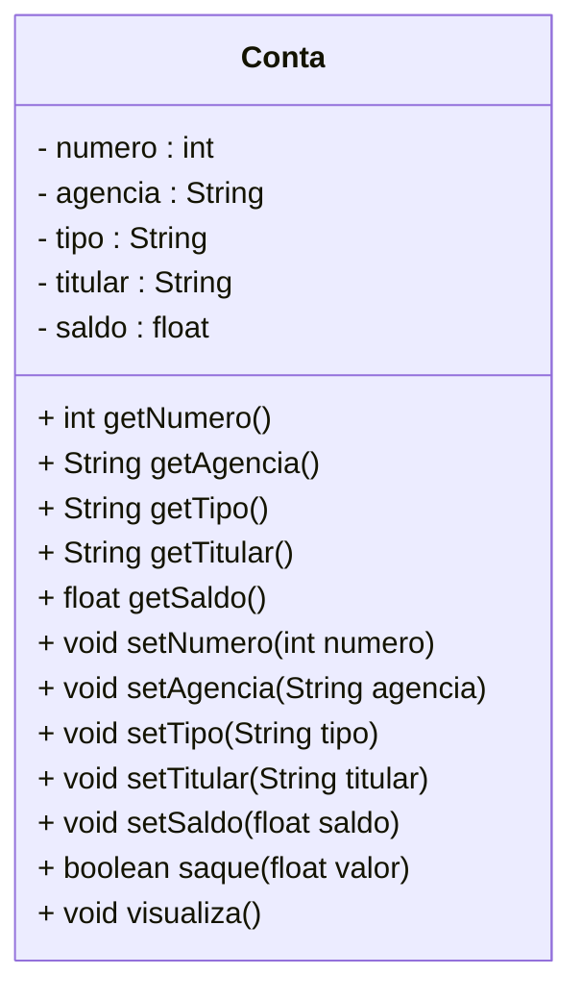

<h1>Programação Orientada a Objetos</h1>

Em geral, quanto maior o software, mais complexo é o seu desenvolvimento, devido às muitas partes que o compõem o todo e o inter-relacionamento entre estas partes. 

Uma razão frequente para as dificuldades de implementação, testes e manutenção é que, em geral, quando se segue uma lógica de projeto de software voltado apenas nas funcionalidades, o sistema é desenvolvido estruturado de acordo com o que ele faz, sem uma preocupação em representar o processo de uma maneira similar ao que acontece no mundo real, ou seja, no dia a dia.

O problema dessa abordagem é que, de tempos em tempos, as empresas mudam seus processos e procedimentos. Isso significa que, o software também terá que mudar e se ele foi todo estruturado de acordo com o que ele precisava fazer antes, pode ser que agora ele precise ser totalmente reestruturado ou ser refeito, a menos que façamos um POG "Programação Orientada a Gambiarras" para manter as coisas funcionando.

Entretanto, alguns desenvolvedores pensaram: "Se as funções de uma empresa e de um software mudam com muita frequência, eu não posso usá-las para basear a organização de meu programa". Essa foi a primeira grande conclusão dos fatos acima. A pergunta que levou à segunda grande conclusão foi: "Mas o que é que, em uma empresa e em seus processos, raramente muda?" Por sorte alguém conseguiu perceber coisas que raramente mudam: **as coisas!**

Como assim, as coisas? **Simples: tudo aquilo que é físico**. Existe uma grande constância no uso de formulários, na produção de um determinado produto, nos funcionários envolvidos em um procedimento, entre outros. As entidades são muito constantes, os objetos envolvidos na realização dos processos são, quase sempre, os mesmos. E disso surgiu a segunda grande conclusão: "Vamos basear a estrutura do software nos objetos envolvidos em seus processos e não nos processos em sí".

**Programação Orientada a Objetos** (POO) **é um paradigma de programação que ajuda a definir a estrutura de programas de computadores, baseado nos conceitos do mundo real, sejam eles reais ou abstratos.** A ideia é simular as coisas que existem e acontecem no mundo real no mundo virtual.

- O mundo real é composto de objetos que interagem entre si.
- Um modelo orientado a objetos é composto de objetos que interagem entre si.

> **Abstrato:** Algo que não é concreto; que resulta da abstração, que opera unicamente com ideias, com associações de ideias, não diretamente com a realidade sensível, que possui um alto grau de generalização 

Da teoria de sistemas, temos que um sistema é um conjunto de entidades que interagem entre si a fim de produzir um resultado comum. Assim, é natural o uso de "objetos programa" a fim de compor um sistema computacional.

<h2>Objetos</h2>

No mundo real, objetos podem ser animados ou inanimados, mas **qualquer um deles possui características que podem ser classificadas como atributos ou comportamentos**. Na imagem abaixo, vemos alguns exemplos de objetos:

Observe que nos exemplos acima cada Objeto foi definido de forma Genérica: Animal, Pessoa, Produto e Conta. Sabemos que a Conta é de uma Banco, mas não sabemos os detalhes da Conta como:

1) Quem é o Titular?
2) Qual é o tipo conta?
3) Qual é o Banco?
4) Qual é a Agência?

O Objeto Conta foi definido de uma forma Abstrata, com poucos ou nenhum detalhe. Nesta etapa, o foco é identificar os Objetos Genéricos, ou seja, uma generalização da Abstração.

Modelar um Sistema baseado em Objetos traz algumas vantagens:

- **Simplificação da concepção do sistema:** a transição da realidade para o modelo é
  facilitada.

- **Simplificação da compreensão do modelo:** como o modelo é mais próximo da realidade,
  a compreensão do modelo por quem compreende o problema real é quase automática.

- **Simplificação do Gerenciamento do sistema:** assim como na realidade, os objetos são
  estáveis na solução de um problema, ou seja, os objetos mudam muito pouco; quando é
  necessário resolver problemas ligeiramente diferentes, modificamos a forma com que os
  objetos interagem e não os objetos em si.

**O que são objetos em programação?**

Em programação (e, de certa forma também na vida real), um objeto é uma entidade caracterizada por um conjunto de operações e um estado, caracterizados por **funções e campos**, podendo ainda ser **compostos por outros Objetos**.

Note que um objeto é uma estrutura similar à uma "estrutura de dados"; porém, além de "dados", um objeto pode armazenar também "funções". Em um objeto os dados são chamados de **Atributos** e as funções são chamadas de **Métodos**.

<h2>Classes</h2>

Classes são como pequenos programas, que podem ser considerados novos tipos de dados. Uma classe pode ser considerada como um "molde" de um objeto, sendo uma descrição de como um objeto pode ser criado. Uma forma interessante de explicar é que uma classe está para um objeto assim como a planta de uma casa está para a casa. 

Repare que a classe em si é um conceito abstrato, como um molde, que se torna concreto e palpável através da criação de um objeto. Chamamos essa criação de **Instanciação da Classe**, como se estivesse usando a Classe como molde para criar vários Objetos.

Na imagem acima vemos que uma Planta pode ser utilizada para construir N casas. Da mesma forma, uma Classe pode instanciar (criar) vários Objetos.

Como todo programa, uma classe é composta por algumas variáveis, que chamamos de **Atributos** e algumas funções que chamaremos de **Métodos**, conforme vimos no tópico anterior. 

Os **Atributos são responsáveis por identificar as características do Objeto**. Veja no exemplo abaixo:

Observe que definindo os Atributos do Objeto nós conseguimos identificar os detalhes da Conta e automaticamente conseguimos responder as perguntas. Cada classe deve representar um conceito (Conta, Pessoa, Animal, Produto) e um conceito pode ser descrito através dos seus Atributos (Conta: titular, tipo, banco, agencia e etc.).

Os **Métodos são responsáveis por definir as ações que irão modificar e/ou interagir com os Atributos**.

Observe no Diagrama acima, que ele identifica algumas ações que os Objetos Conta possuem (Sacar, Depositar, Transferir, Abrir conta e Fechar conta).

Observe também que os **Atributos são identificados por substantivos** e os **Métodos são identificados por verbos**.

Na Computação um Sistema Orientado a Objetos é visto como um conjunto de Objetos agrupados em Classes de Objetos similares que interagem através da troca de mensagens (Chamada dos Métodos). Cada **classe** é um **modelo** **estático** que permite especificar um conjunto de características do conceito que representa. Cada **objeto** é uma **entidade** **dinâmica** criada a partir de uma classe, que possui os dados sobre os quais são realizadas as operações disponíveis em sua Classe. **Todos os objetos são instâncias de uma classe, ou seja, é a materialização de um conceito formalizado**.

**Exemplo:** 

**Conta** **é uma classe.**

**A Conta da Maria Joaquina e a Conta do João da Silva são instâncias da Classe Conta, ou seja, Objetos.**

<h3>Representação Gráfica</h3>

Para representar uma Classe graficamente na Orientação Objetos, utilizamos o **Diagrama de Classes**, que faz parte da **UML - Unified Model Language**, que é uma Linguagem de Modelagem Unificada para Sistemas Orientados a Objetos. Veja o Diagrama de Classes da nossa Classe Conta abaixo:

O Diagrama de Classes é organizado da seguinte forma:

- **Nome:** Nome da Classe.
- **Campos:** São os Atributos da Classe. Os Atributos podem vir acompanhados do seu tipo de dado.
- **Métodos:** São as ações da Classe. Os Métodos podem vir acompanhados do seu tipo de dado de entrada e saída.

<h3>Visibilidade</h3>

A visibilidade merece um tópico a parte. A visibilidade ou Modificadores de acesso determina como Método ou Atributo será manipulado no decorrer do desenvolvimento do programa, ou seja, qual (is) Classes podem chamar o Método. Na tabela abaixo temos os Modificadores de visibildade:

| **Modificador** | **Descrição**                                                | UML  |
| --------------- | ------------------------------------------------------------ | ---- |
| **padrão**      | Um Método ou Atributo padrão (identificado pela ausência de modificadores) poderá ser acessado por todas as classes que estiverem **no mesmo pacote**, que a classe que possui o Atributo. |      |
| **public**      | Um Método ou Atributo public poderá ser acessado por qualquer classe em qualquer pacote. O  acesso a um método só é permitido se você tiver primeiro acesso à classe (Pública). | +    |
| **protected**   | Um Método ou Atributo protected é protegido e pode ser chamado por todas as classes que compõe o pacote  **package**. A grande diferença para o modificador padrão é que uma classe (mesmo que esteja fora do pacote), que estende a Classe com o Atributo ou o Método protected, ela terá acesso a ele, logo o acesso é por pacote e por herança. | #    |
| **private**     | Um Método ou Atributo private possui o acesso restrito. Somente a Classe que o definiu pode acessá-lo, ou seja, um  método privado só poderá ser acessado dentro da classe que o definiu. | -    |

Observe que na coluna UML da tabela, temos o símbolo que identifica a visibilidade do Método. O mais comum na Modelagem de uma Classe é **manter os Atributos Private (-) e os Métodos Public (+)**.

Nas imagens abaixo podemos visualizar o funcionamento dos modificadores com Métodos em 3 situações diferentes:

<table> 
	<tr>
		<td>

</td>
        <td>

</td>
	</tr>
    <tr>
		<td>
Na própria Classe
</td>
        <td>
Classes do mesmo Pacote
</td>
	</tr>
    <tr>
		<td colspan="2">

</td>
	</tr>
    <tr>
        <td colspan="2">
Classes de Pacotes diferentes
</td>
	</tr>
</table>

Resumindo...

| Modificador   | Classe | Pacote | Sub Classe | Mundo |
| ------------- | :----: | :----: | :--------: | :---: |
| **public**    |   ✔    |   ✔    |     ✔      |   ✔   |
| **protected** |   ✔    |   ✔    |     ✔      |   ❌   |
| **padrão**    |   ✔    |   ✔    |     ❌      |   ❌   |
| **private**   |   ✔    |   ❌    |     ❌      |   ❌   |

  

<a href="README.md">Voltar</a>

